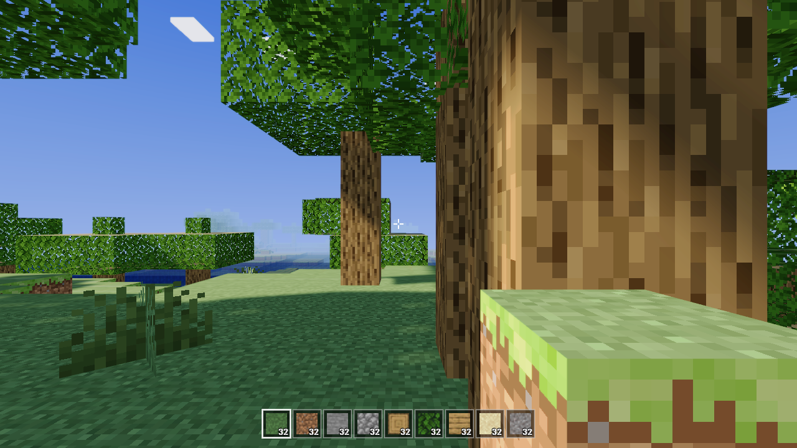
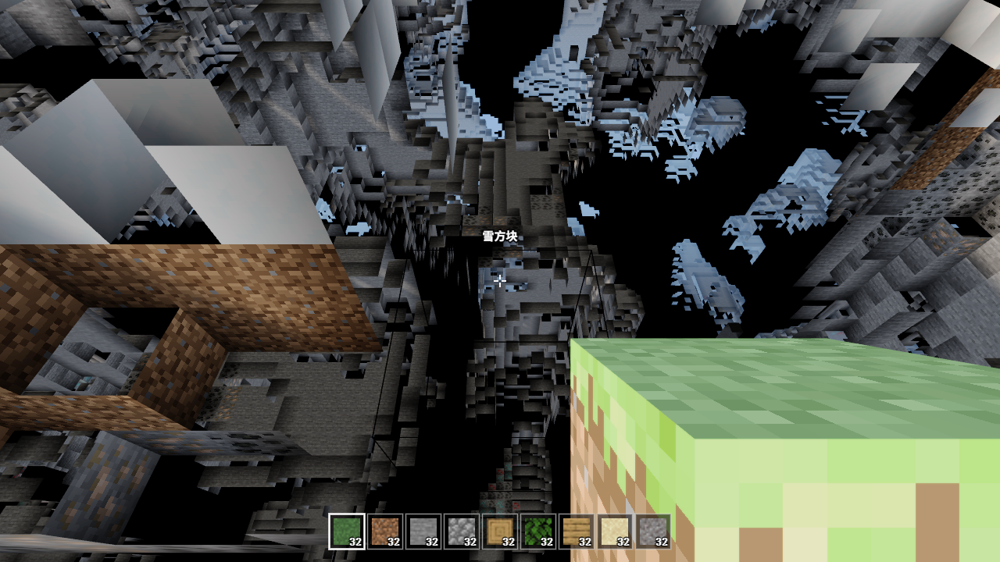
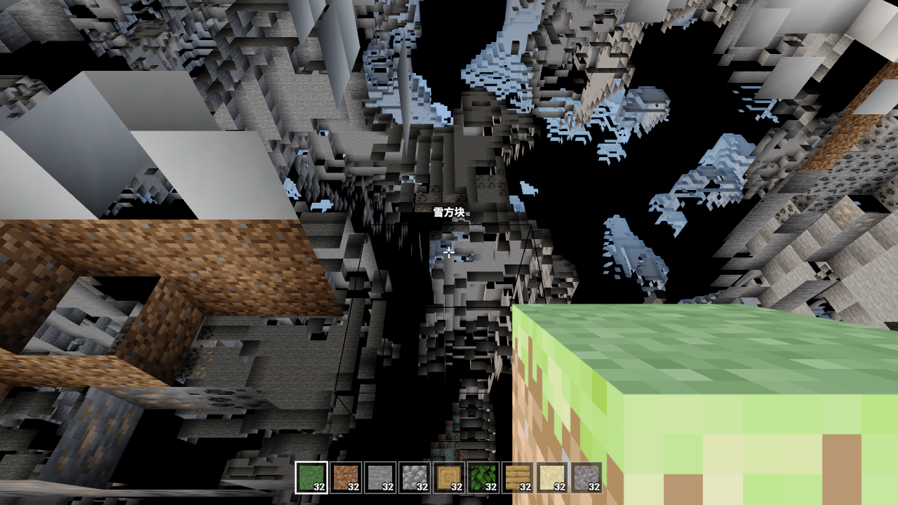
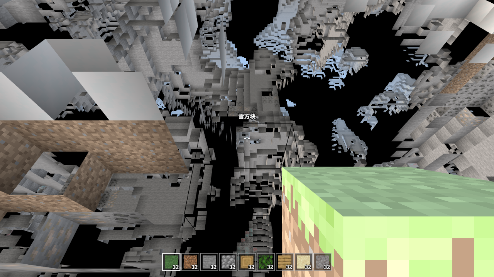

# 方境 · Cubic Wilds

> A browser-native voxel sandbox — 体素世界、探索、建造与生存，全部运行在浏览器中。

<p align="center">
  
</p>

<p align="center">
  <strong>Three.js · WebGL · Procedural World · Survival / Creative · Offline Ready</strong>
</p>

## 关于项目

**方境 · Cubic Wilds** 是一个使用原生 JavaScript 与 Three.js 构建的浏览器体素沙盒游戏。项目重点不是简单绘制方块，而是尽可能实现完整的第一人称体素游戏体验：程序化世界生成、区块流式加载、碰撞与移动、挖掘与放置、掉落物、生存/创造模式、昼夜循环以及实时光影。

项目无需框架和构建步骤，核心运行时与游戏资源均保存在仓库中。

> 本项目是独立的学习与实验性作品，与 Mojang Studios / Microsoft 无隶属关系。Minecraft 为其各自权利人的商标。

## 亮点

- **程序化世界**：种子化 FBM 地形、平原/森林/沙漠/雪原、多层洞穴、矿石与树木生成。
- **区块系统**：16×16×128 区块、视距流式加载、远区块卸载、脏区块限量重建。
- **第一人称物理**：AABB 碰撞、跳跃、疾跑、潜行、跨步与固定步长物理。
- **挖掘与建造**：方块硬度、分阶段裂纹、粒子、掉落物、拾取与连续放置。
- **生存 / 创造**：不同挖掘与飞行逻辑，热栏、物品栏和掉落计数。
- **环境表现**：昼夜循环、太阳/月亮/星空、云层、动态雾、阴影、Bloom 与 ACES 色调映射。
- **本地运行**：Three.js 与纹理本地化，可直接离线启动。
- **自动测试基础**：逻辑测试与浏览器测试脚本已包含在仓库中。

## 截图

| 完整效果 | 关闭阴影 | 关闭后期效果 |
| --- | --- | --- |
|  |  |  |

## 快速开始

### 直接运行

双击 `index.html` 即可启动。

### 本地服务器

Windows 可运行：

```bat
start.bat
```

也可以使用任意静态文件服务器。

## 操作

| 按键 | 功能 |
| --- | --- |
| `WASD` | 移动 |
| `Space` | 跳跃 / 创造模式双击切换飞行 |
| `Shift` | 潜行 |
| `Ctrl` / 双击 `W` | 疾跑 |
| 鼠标 | 视角 |
| 左键 | 挖掘 |
| 右键 | 放置 |
| `1-9` / 滚轮 | 热栏选择 |
| `E` | 物品栏 |
| `F3` | 调试信息 |
| `Esc` | 暂停 |

## 技术架构

```text
index.html          页面入口与菜单
lib/three.min.js    Three.js r159
js/
  noise.js          确定性噪声与 FBM
  blocks.js         方块定义
  textures.js       纹理加载与 tint
  textures_data.js  内嵌纹理数据
  world.js          区块与地形生成
  mesher.js         网格生成与面剔除
  physics.js        AABB 碰撞
  player.js         玩家控制
  hand.js           第一人称手持物
  interaction.js    挖掘、放置、掉落与粒子
  environment.js    天空、昼夜、云、光照
  postfx.js         后期效果
  audio.js          WebAudio 音效
  ui.js             HUD / 菜单 / 物品栏
  main.js           主循环与输入
assets/textures/    方块纹理
tools/              资源处理脚本
test/               逻辑与浏览器测试
```

## 开发与测试

安装开发依赖：

```bash
npm ci
```

运行逻辑测试：

```bash
npm test
```

运行浏览器测试：

```bash
npm run test:browser
```

纹理数据重新生成：

```bash
npm run textures
```

## 已知限制

- 暂无持久化存档系统。
- 暂无生物、合成和红石类系统。
- 液体系统仍在继续完善。

## Roadmap

- [ ] 世界存档 / 读取
- [ ] 更完整的水与岩浆流体模拟
- [ ] 合成与工具耐久
- [ ] 生物与基础 AI
- [ ] 更完善的性能分级与移动端适配
- [ ] GitHub Pages 在线试玩

## 第三方资源与许可

项目代码采用 **Apache License 2.0**。第三方引擎、纹理及其他资源保留其各自许可，详见 [`THIRD_PARTY_NOTICES.md`](THIRD_PARTY_NOTICES.md)。
